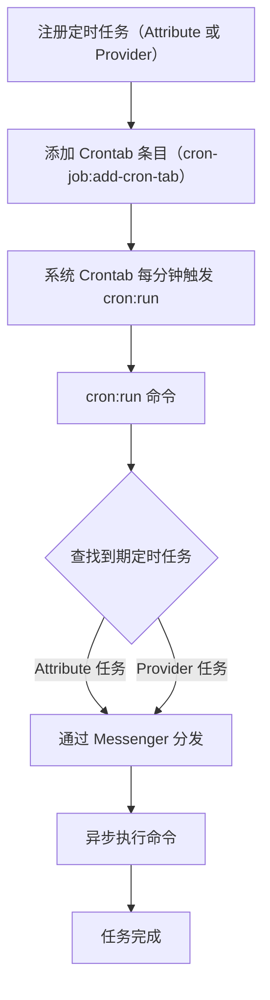

# 定时任务执行流程说明

本文档通过 Mermaid 流程图展示 Symfony Cron Job Bundle 的定时任务注册、调度与执行流程。

## 步骤说明

1. **注册定时任务**：通过 Attribute 或实现 Provider 接口。
2. **添加 Crontab 条目**：使用内置命令注册主调度入口。
3. **Crontab 触发**：系统 Crontab 每分钟运行 Symfony 命令。
4. **查找到期任务**：根据 Cron 表达式判断哪些任务到期。
5. **分发执行**：到期任务通过 Messenger 异步分发。
6. **执行与监控**：任务被执行，可监控输出与状态。
